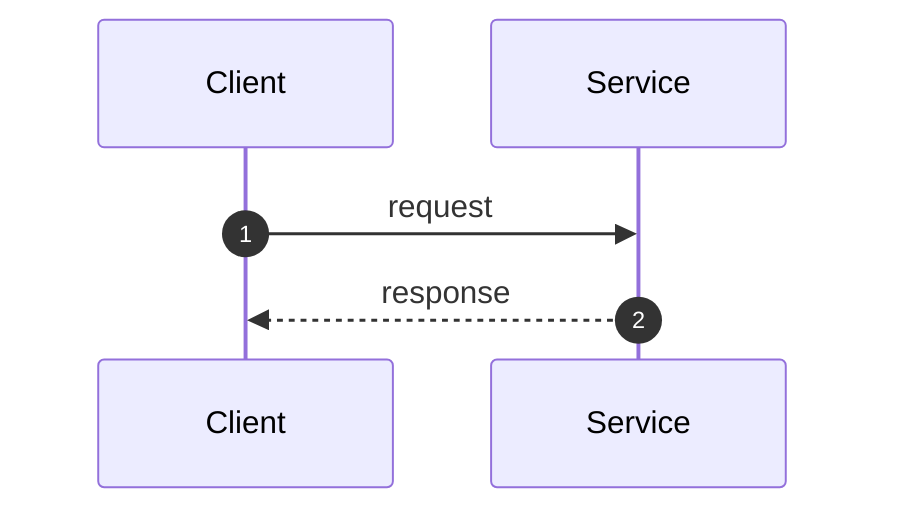
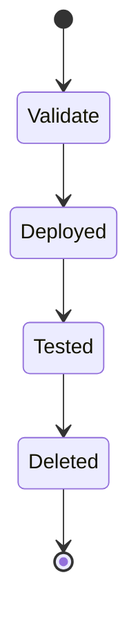

# Workflow · NN Project Name

[← Project README](../README.md)

## Main request flow

```mermaid
sequenceDiagram
    autonumber
    participant C as Client
    participant S as Service
    C->>S: request
    S-->>C: response
```

## Deploy lifecycle

```mermaid
stateDiagram-v2
    [*] --> Validate
    Validate --> Deployed
    Deployed --> Tested
    Tested --> Deleted
    Deleted --> [*]
```
